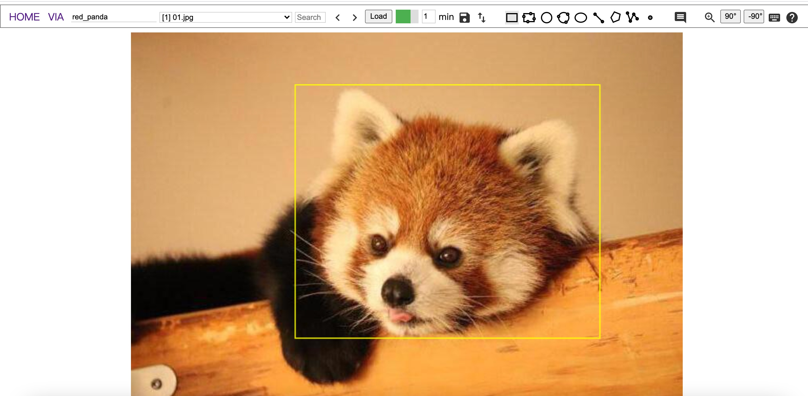

# image-annotator-flask
A customized version of VIA image annotator which supports server deployment (python-flask backend).

## Description
在VIA的图像标注工具上做了升级，增加了flask后端。没用数据库，只配置文件夹来管理数据。增加了自动保存和逐张加载的功能。

A lightweight version for deployment image annotator on server. Without database plugin, it only uses a config file with directory paths. Auto-save and download images one by one when browse.

## Requirements
flask, tqdm, yaml, PIL, etc.

## UI

## How to use?
learn from VIA image annotator version 3 
https://www.robots.ox.ac.uk/~vgg/software/via/

## Start
run with script run.sh

## Update History
    2021.08.31, 1. 增加了数据的users属性，根据用户名显示可用的数据
                2. 修复了select选择图片未能自动加载的bug
                3. 增加了voc与本数据格式（via）之间的转换工具

## TODO
- [ ] 在服务器端的每个样本标注单独保存 (Save annotation file separately)
- [ ] 支持一键转化输出coco等格式 (Support convert annotation file to coco or any other formats by one-click)
- [ ] 支持图片分布在多个目录（Support read images of one dataset from multi-directory）
